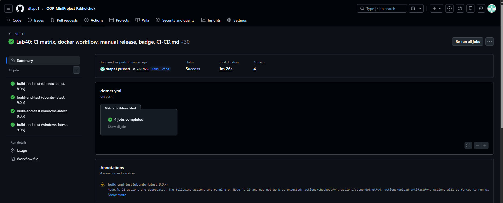
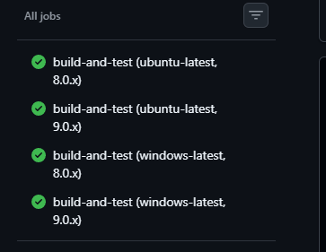
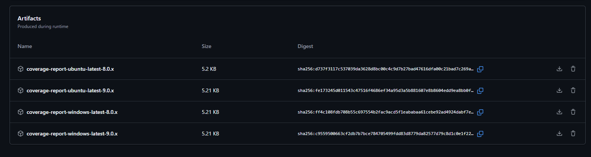

# CI/CD Guide — Car Rental System

## Workflows

| Файл | Назва | Призначення |
|---|---|---|
| `dotnet.yml` | .NET CI | Збірка, тести, coverage, matrix |
| `docker.yml` | Docker Build | Збірка Docker образу |
| `manual-release.yml` | Manual Release | Ручний реліз на staging/production |

## Тригери

| Workflow | Тригер |
|---|---|
| .NET CI | push/PR до main |
| Docker Build | push до main або тег v* |
| Manual Release | workflow_dispatch (ручний) |

## Matrix Strategy

CI запускається на 4 комбінаціях:
- ubuntu-latest + .NET 8.0.x
- ubuntu-latest + .NET 9.0.x
- windows-latest + .NET 8.0.x
- windows-latest + .NET 9.0.x

Це дозволяє виявити проблеми сумісності між версіями .NET і ОС.

## Artifacts

Coverage звіти зберігаються 14 днів у вкладці Actions → відповідний run → Artifacts.
Release артефакти зберігаються після ручного запуску Manual Release.

Як завантажити: Actions → вибрати run → внизу розділ Artifacts → Download.

## Як додати новий check

1. Відкрий `.github/workflows/dotnet.yml`
2. Додай новий step після існуючих:
```yaml
- name: My new check
  run: dotnet my-tool --check
```
3. Закомть і запуш — check автоматично з'явиться в наступному run.

## Branch Protection + Required Checks

main захищений — merge можливий тільки якщо CI пройшов.
Якщо тест зламаний — PR буде заблокований автоматично.

## Скріншоти



