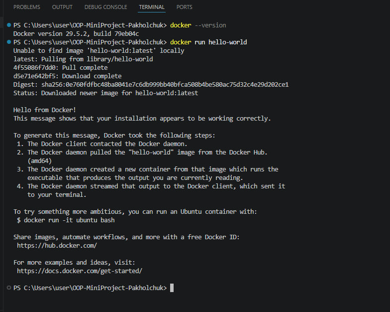
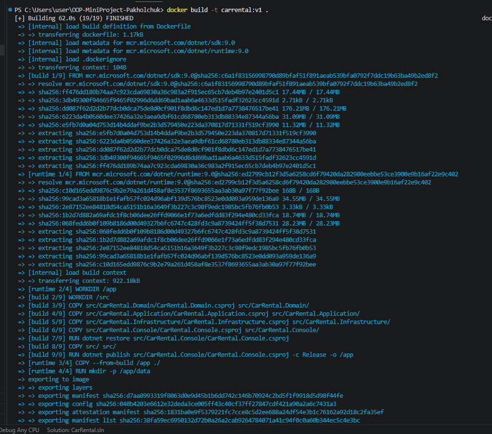
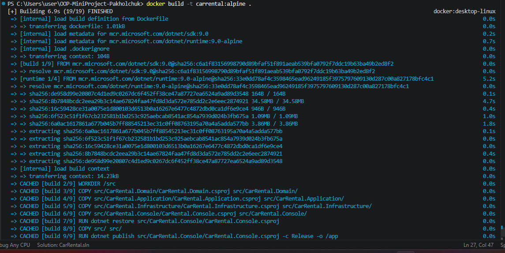
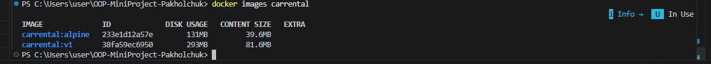

# Docker Guide — Car Rental System

## Вимоги
- Docker Desktop встановлений і запущений

## Збірка образу

### Runtime образ (~293MB)
```powershell
docker build -t carrental:v1 .
```

### Alpine образ (~131MB)
```powershell
docker build -t carrental:alpine .
```

## Запуск контейнера

### Базовий запуск
```powershell
docker run --rm -it carrental:alpine
```

### З volume для збереження даних
```powershell
docker run --rm -it -v ${PWD}/data:/app/data carrental:alpine
```

## Docker Compose

### Запуск
```powershell
docker compose up --build
```

### Зупинка
```powershell
docker compose down
```

## Порівняння розмірів образів

| Підхід | Базовий образ | Розмір |
|---|---|---|
| Single-stage (SDK) | sdk:9.0 | ~900 MB |
| Multi-stage (runtime) | runtime:9.0 | ~293 MB |
| Multi-stage (alpine) | runtime:9.0-alpine | ~131 MB |

Alpine менший бо використовує мінімальний Linux дистрибутив без зайвих утиліт.
SDK образ містить весь інструментарій для розробки — компілятор, NuGet, тощо.
Multi-stage build дозволяє збирати в SDK а запускати в легкому runtime.

### Скріни

Docker версія і перевірка роботи:


Збірка runtime образу:


Збірка alpine образу:


Порівняння розмірів:


## Volumes
Папка `data/` містить JSON файли з даними системи:
- `data/cars.json` — список автомобілів
- `data/clients.json` — список клієнтів
- `data/rentals.json` — список оренд

Без volume mapping дані зникають після зупинки контейнера.
З volume mapping дані зберігаються між запусками контейнера.

## Graceful Shutdown
При отриманні сигналу зупинки (Ctrl+C або docker stop) система
автоматично зберігає всі дані в JSON файли перед завершенням.
Реалізовано через Console.CancelKeyPress і AppDomain.CurrentDomain.ProcessExit.

## Перевірка роботи
```powershell
# Перегляд образів
docker images carrental

# Перегляд запущених контейнерів
docker ps

# Перегляд логів
docker logs <container_id>
```