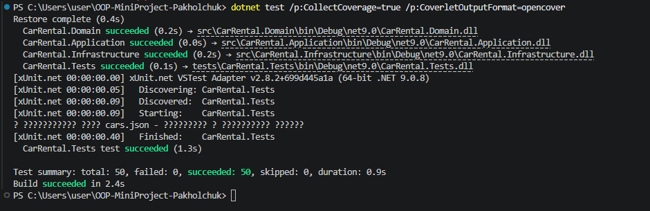

# Testing Guide

## Запуск тестів

### Базовий запуск
```powershell
dotnet test
```

### З coverage звітом
```powershell
dotnet test /p:CollectCoverage=true /p:CoverletOutputFormat=opencover
```

## Що покрито тестами

## Результати запуску


### Юніт-тести (42 тести)
- `CarTests` — інваріанти Car, доступність
- `RentalTests` — розрахунок вартості, переходи статусів
- `PricingStrategyTests` — Strategy патерн, розрахунки
- `RentalServiceTests` — бізнес-логіка сервісу
- `CarRentalTheoryTests` — параметризовані кейси, негативні сценарії

### Інтеграційні тести (8 тестів)
- `IntegrationTests` — збереження/завантаження JSON, повний цикл

## Негативні сценарії
- Оренда недоступного авто
- Завершення вже завершеної оренди
- Скасування після завершення
- Завантаження пошкодженого JSON
- Завантаження відсутнього файлу