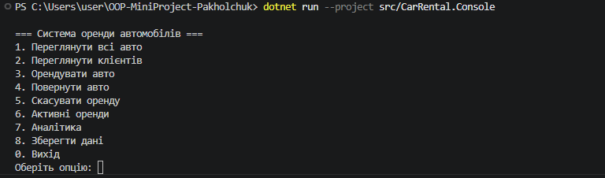

# User Guide — Car Rental System

## Запуск

## Головне меню

## Сценарії використання
### Оренда авто
1. Оберіть `3. Орендувати авто`
2. Оберіть номер авто зі списку доступних
3. Оберіть номер клієнта
4. Введіть дату початку у форматі `dd.MM.yyyy` (наприклад `20.05.2026`)
5. Введіть дату кінця
6. Оберіть тариф або натисніть Enter для стандартного
7. Система підтвердить оренду і покаже вартість

### Повернення авто
1. Оберіть `4. Повернути авто`
2. Оберіть номер оренди зі списку активних
3. Система завершить оренду і авто стане доступним

### Скасування оренди
1. Оберіть `5. Скасувати оренду`
2. Оберіть номер активної оренди
3. Оренда скасовується, авто повертається в пул

### Аналітика
1. Оберіть `7. Аналітика`
2. Система покаже загальний дохід, кількість доступних авто і активних оренд
3. Можна відфільтрувати авто за діапазоном ціни

## Тарифи
- **Стандартний** — ціна за день × кількість днів
- **Зі знижкою 10%** — стандартна ціна × 0.9
- **Зі знижкою 20%** — стандартна ціна × 0.8

## Збереження даних
- Дані зберігаються автоматично після кожної оренди, повернення і скасування
- При виборі `8. Зберегти дані` або `0. Вихід` — збереження гарантоване
- Файли зберігаються в папці `data/` поруч з проєктом

## Обробка помилок
- Невірна дата → система повідомить і поверне в меню
- Спроба орендувати зайняте авто → система повідомить про помилку
- Пошкоджений файл даних → система стартує з порожнім списком