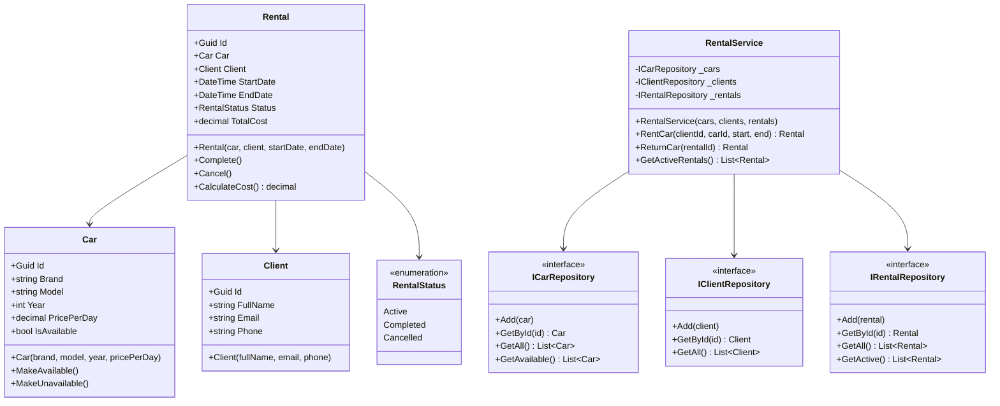

# Діаграма класів — Car Rental System

```mermaid
classDiagram
    class Car {
        +Guid Id
        +string Brand
        +string Model
        +int Year
        +decimal PricePerDay
        +bool IsAvailable
        +Car(brand, model, year, pricePerDay)
        +MakeAvailable()
        +MakeUnavailable()
    }

    class Client {
        +Guid Id
        +string FullName
        +string Email
        +string Phone
        +Client(fullName, email, phone)
    }

    class Rental {
        +Guid Id
        +Car Car
        +Client Client
        +DateTime StartDate
        +DateTime EndDate
        +RentalStatus Status
        +decimal TotalCost
        +Rental(car, client, startDate, endDate)
        +Complete()
        +Cancel()
        +CalculateCost() decimal
    }

    class RentalStatus {
        <<enumeration>>
        Active
        Completed
        Cancelled
    }

    class ICarRepository {
        <<interface>>
        +Add(car)
        +GetById(id) Car
        +GetAll() List~Car~
        +GetAvailable() List~Car~
    }

    class IClientRepository {
        <<interface>>
        +Add(client)
        +GetById(id) Client
        +GetAll() List~Client~
    }

    class IRentalRepository {
        <<interface>>
        +Add(rental)
        +GetById(id) Rental
        +GetAll() List~Rental~
        +GetActive() List~Rental~
    }

    class RentalService {
        -ICarRepository _cars
        -IClientRepository _clients
        -IRentalRepository _rentals
        +RentalService(cars, clients, rentals)
        +RentCar(clientId, carId, start, end) Rental
        +ReturnCar(rentalId) Rental
        +GetActiveRentals() List~Rental~
    }

    Rental --> Car
    Rental --> Client
    Rental --> RentalStatus
    RentalService --> ICarRepository
    RentalService --> IClientRepository
    RentalService --> IRentalRepository
```