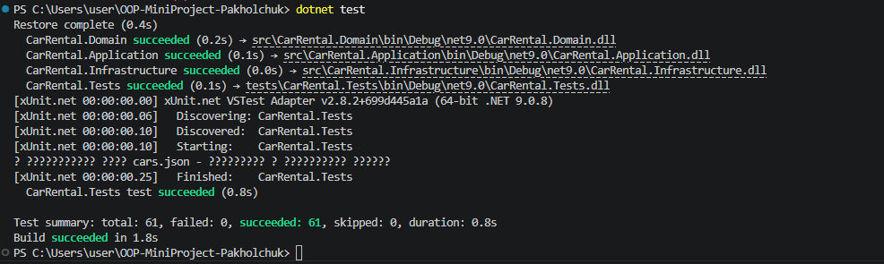

# Extension Report — Sam29

## Розширення А — Гнучкий фільтр на делегатах

**Вхідний артефакт:** RentalService з жорстко заданими фільтрами GetAvailableCars, GetCarsSortedByPrice.

**Що змінено:** Додав два методи в RentalService:
- `FilterCars(Func<Car, bool> predicate)` — фільтр авто за будь-яким предикатом
- `FilterRentals(Func<Rental, bool> predicate)` — фільтр оренд за будь-яким предикатом

**Результат:** Будь-яка фільтрація без зміни сервісу — передаю лямбду як параметр.

**Що підготував для Б:** RentalAnalytics отримав гнучкий інструмент для побудови звітів без дублювання логіки.

## Розширення Б — Аналітичний модуль RentalAnalytics

**Вхідний артефакт:** FilterCars і FilterRentals з Розширення А.

**Що створено:** Новий клас `src/CarRental.Application/RentalAnalytics.cs` з методами:
- `GetRevenueByPricingStrategy()` — дохід по кожному тарифу через GroupBy
- `GetTopClients(int top)` — топ клієнтів за кількістю оренд
- `GetUtilizationRate()` — відсоток зайнятих авто
- `GetCarsExpensiveThan(decimal price)` — авто дорожчі за ціну
- `GetRentalsInDateRange(DateTime from, DateTime to)` — оренди в діапазоні дат

**Результат:** Повноцінний аналітичний модуль на делегатах і LINQ.

**Що підготував для В:** Конкретні методи з чіткою логікою — ідеально для Theory тестів.

## Розширення В — Theory тести для аналітики

**Вхідний артефакт:** FilterCars, FilterRentals, RentalAnalytics з А і Б.

**Що створено:** `tests/CarRental.Tests/AnalyticsTests.cs` з 9 тестами:
- Theory тест GetCarsExpensiveThan з 3 наборами даних
- Тести FilterCars за доступністю і ціною
- Тести FilterRentals за статусом
- Тести GetUtilizationRate, GetRevenueByPricingStrategy, GetTopClients, GetRentalsInDateRange

**Результат:** 

