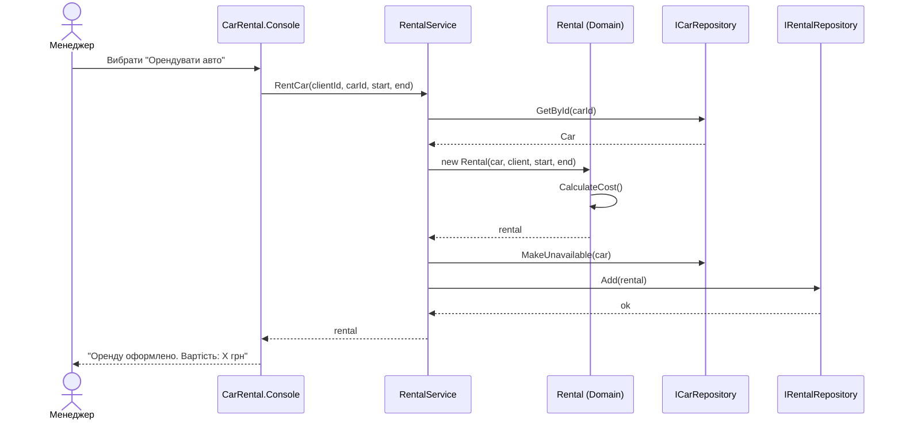

# Діаграма послідовності — Оренда автомобіля

```mermaid
sequenceDiagram
    actor Manager as Менеджер
    participant Console as CarRental.Console
    participant Service as RentalService
    participant Domain as Rental (Domain)
    participant CarRepo as ICarRepository
    participant RentalRepo as IRentalRepository

    Manager->>Console: Вибрати "Орендувати авто"
    Console->>Service: RentCar(clientId, carId, start, end)
    Service->>CarRepo: GetById(carId)
    CarRepo-->>Service: Car
    Service->>Domain: new Rental(car, client, start, end)
    Domain->>Domain: CalculateCost()
    Domain-->>Service: rental
    Service->>CarRepo: MakeUnavailable(car)
    Service->>RentalRepo: Add(rental)
    RentalRepo-->>Service: ok
    Service-->>Console: rental
    Console-->>Manager: "Оренду оформлено. Вартість: X грн"
```